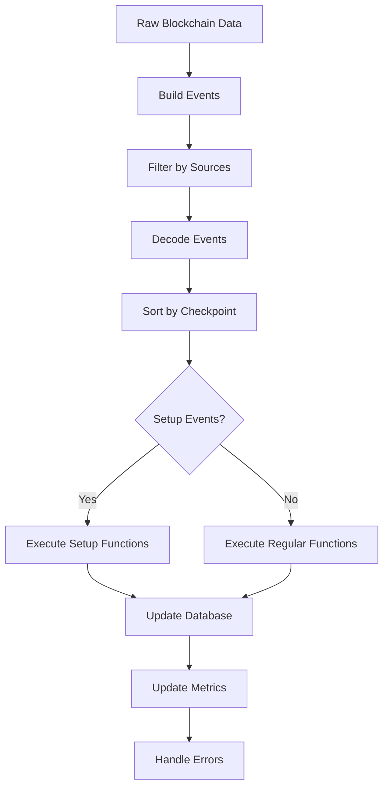

# Ponder Indexing Engine Documentation

## Overview

Ponder's indexing engine is the core system responsible for processing blockchain events and executing user-defined indexing functions. It transforms raw blockchain data into structured, queryable database records through a sophisticated pipeline that handles compilation, event ordering, execution, and database operations.

The indexing engine operates in two distinct phases:
1. **Historical Phase**: Batch processing of past events with aggressive optimizations
2. **Realtime Phase**: Individual processing of new events as they arrive

## Architecture Overview

```
┌─────────────────┐    ┌─────────────────┐    ┌─────────────────┐
│   Build System  │    │ Event Processing│    │   Database      │
│                 │    │                 │    │                 │
│ Vite Compiler   │───▶│ Event Creation  │───▶│ Indexed Data    │
│ Hot Reload      │    │ Checkpoint Sort │    │ Type Safety     │
│ Type Checking   │    │ Function Exec   │    │ Transactions    │
└─────────────────┘    └─────────────────┘    └─────────────────┘
         │                       │                       │
         │                       │                       │
         ▼                       ▼                       ▼
┌─────────────────┐    ┌─────────────────┐    ┌─────────────────┐
│   Source Files  │    │      Events     │    │     Context     │
│                 │    │                 │    │                 │
│ ponder.config   │    │ Logs/Traces     │    │ Chain Client    │
│ ponder.schema   │    │ Transactions    │    │ Contracts       │
│ /src/index.ts   │    │ Blocks          │    │ Database        │
└─────────────────┘    └─────────────────┘    └─────────────────┘
```

## Core Components

### 1. Build System (`/build/index.ts`)

The build system uses **Vite** and **ViteNode** for TypeScript compilation and hot module replacement:

```typescript
export type Build = {
  executeConfig: () => Promise<ConfigResult>;
  executeSchema: () => Promise<SchemaResult>;
  executeIndexingFunctions: () => Promise<IndexingResult>;
  executeApi: () => Promise<ApiResult>;
  compileIndexing: () => Promise<Result<IndexingBuild>>;
  startDev: (params: { onReload: () => void }) => void;
};
```

**Key Features**:
- **Hot Module Replacement**: Automatically recompiles and reloads changes
- **Error Handling**: Rich error messages with source maps
- **Build Artifacts**: Generates hashed build IDs for cache invalidation
- **Global Injection**: Makes common services available to user code

### 2. Event Processing Pipeline

#### Event Creation (`/sync/events.ts`)

Raw blockchain data is transformed into typed events:

```typescript
export const buildEvents = ({
  sources,
  blockData: { block, logs, transactions, transactionReceipts, traces },
  childAddresses,
  chainId,
}) => {
  const events: RawEvent[] = [];
  
  // Process different event types
  for (const source of sources) {
    switch (source.type) {
      case "contract":
        // Handle log and trace events
        break;
      case "account":
        // Handle transaction and transfer events
        break;
      case "block":
        // Handle block events
        break;
    }
  }
  
  // Sort events by checkpoint for deterministic ordering
  events.sort((a, b) => (a.checkpoint < b.checkpoint ? -1 : 1));
  return events;
};
```

#### Event Decoding

Events are decoded from raw blockchain data with comprehensive error handling:

```typescript
export const decodeEvents = (events: RawEvent[]) => {
  return events.map((event) => {
    try {
      switch (event.type) {
        case "log":
          return decodeLogEvent(event);
        case "trace":
          return decodeTraceEvent(event);
        // ... other event types
      }
    } catch (error) {
      // Log decoding errors but continue processing
      common.logger.debug({
        service: "sync",
        msg: `Failed to decode ${event.type} event`,
        error,
      });
      return undefined;
    }
  }).filter(Boolean);
};
```

### 3. Checkpoint System

Ponder uses a sophisticated checkpoint system for deterministic event ordering:

```typescript
type Checkpoint = {
  blockTimestamp: bigint;    // 10 digits
  chainId: bigint;          // 16 digits  
  blockNumber: bigint;      // 16 digits
  transactionIndex: bigint; // 16 digits
  eventType: number;        // 1 digit
  eventIndex: bigint;       // 16 digits
};
```

**Checkpoint Encoding**:
```typescript
export const encodeCheckpoint = (checkpoint: Checkpoint): string => {
  return [
    checkpoint.blockTimestamp.toString().padStart(10, "0"),
    checkpoint.chainId.toString().padStart(16, "0"),
    checkpoint.blockNumber.toString().padStart(16, "0"),
    checkpoint.transactionIndex.toString().padStart(16, "0"),
    checkpoint.eventType.toString(),
    checkpoint.eventIndex.toString().padStart(16, "0"),
  ].join("");
};
```

**Event Ordering**:
- **Within Block**: `transactionIndex` → `eventType` → `eventIndex`
- **Across Blocks**: `blockTimestamp` → `chainId` → `blockNumber`
- **Global Ordering**: Lexicographic sort of 79-character checkpoint strings

### 4. Indexing Function Execution

#### Context Creation (`/indexing/index.ts`)

Each indexing function receives a context object with chain-specific information:

```typescript
type Context = {
  chain: { id: number; name: string };
  client: ReadonlyClient;
  db: Db<Schema>;
  contracts: Record<string, {
    abi: Abi;
    address?: Address;
    factory?: Factory;
  }>;
};
```

#### Function Execution Loop

```typescript
export const createIndexing = ({ common, database, schemaBuild }) => {
  return {
    async processEvents(events: Event[]) {
      for (const event of events) {
        try {
          // Update context for current event
          const context = {
            chain: { id: event.chainId, name: event.chain.name },
            client: clientsByChainId[event.chainId],
            db: database.qb,
            contracts: contractsByChainId[event.chainId],
          };
          
          // Execute indexing function
          const indexingFunction = indexingFunctions[event.name];
          await indexingFunction({ event, context });
          
          // Update metrics
          common.metrics.ponder_indexing_function_duration.observe(
            { event: event.name },
            performance.now() - startTime
          );
        } catch (error) {
          // Enrich error with event context
          throw addEventContext(error, event);
        }
      }
    }
  };
};
```

## Database Integration

### 1. Client Optimization (`/indexing/client.ts`)

Ponder implements a sophisticated multi-tier caching system:

```typescript
export const createCachedViemClient = ({ transport, chain }) => {
  const memoryCache = new Map<string, any>();
  const databaseCache = new DatabaseCache();
  
  return {
    async request({ method, params }) {
      // 1. Check memory cache
      const cacheKey = `${method}:${JSON.stringify(params)}`;
      if (memoryCache.has(cacheKey)) {
        return memoryCache.get(cacheKey);
      }
      
      // 2. Check database cache
      const dbResult = await databaseCache.get(cacheKey);
      if (dbResult) {
        memoryCache.set(cacheKey, dbResult);
        return dbResult;
      }
      
      // 3. Make RPC request
      const result = await transport.request({ method, params });
      
      // 4. Cache result
      memoryCache.set(cacheKey, result);
      await databaseCache.set(cacheKey, result);
      
      return result;
    }
  };
};
```

### 2. Predictive Prefetching

The client uses statistical analysis to predict data access patterns:

```typescript
export class IndexingCache {
  private accessPatterns = new Map<string, number>();
  
  recordAccess(method: string, params: any[]) {
    const pattern = `${method}:${params.join(":")}`;
    this.accessPatterns.set(pattern, (this.accessPatterns.get(pattern) || 0) + 1);
  }
  
  async prefetch(blockNumber: number) {
    // Analyze access patterns and prefetch likely requests
    const predictions = this.predictAccess(blockNumber);
    await Promise.all(predictions.map(pred => this.cache.get(pred)));
  }
}
```

### 3. Database Store Patterns

#### Historical Store (Optimized for Batch Processing)

```typescript
export const createHistoricalIndexingStore = ({ database, cache }) => {
  return {
    async create(args) {
      // Buffer operations in cache
      await cache.insert(args.tableName, args.data);
    },
    
    async flush() {
      // Bulk insert using PostgreSQL COPY
      await cache.flushTables();
    }
  };
};
```

#### Realtime Store (Direct Database Operations)

```typescript
export const createRealtimeIndexingStore = ({ database }) => {
  return {
    async create(args) {
      // Direct database insert with retry logic
      return database.retry(() => 
        database.qb.insert(args.tableName).values(args.data)
      );
    }
  };
};
```

## Historical vs Realtime Processing

### Historical Phase Architecture

```typescript
// Historical processing with aggressive optimizations
const processHistoricalEvents = async (events: Event[]) => {
  const BATCH_SIZE = 93; // Optimized batch size
  
  for (let i = 0; i < events.length; i += BATCH_SIZE) {
    const batch = events.slice(i, i + BATCH_SIZE);
    
    await database.transaction(async (tx) => {
      // Process entire batch in single transaction
      for (const event of batch) {
        await processEvent(event, { 
          store: historicalStore, // Buffered operations
          client: cachedClient,   // Aggressive caching
        });
      }
      
      // Flush cache to database
      await historicalStore.flush();
    });
  }
};
```

### Realtime Phase Architecture

```typescript
// Realtime processing with immediate consistency
const processRealtimeEvents = async (events: Event[]) => {
  for (const event of events) {
    await database.transaction(async (tx) => {
      await processEvent(event, {
        store: realtimeStore,  // Direct operations
        client: realtimeClient, // Minimal caching
      });
    });
  }
};
```

## Event Types and Handling

### 1. Setup Events

Setup events initialize indexing functions before processing blockchain events:

```typescript
type SetupEvent = {
  type: "setup";
  chainId: number;
  name: string;
  checkpoint: string; // ZERO_CHECKPOINT
};

// Setup function signature
export const setupFunction = ({ context }: { context: Context }) => {
  // Initialize state, create initial records, etc.
};
```

### 2. Regular Events

Regular events correspond to actual blockchain data:

```typescript
type LogEvent = {
  type: "log";
  chainId: number;
  name: string;
  checkpoint: string;
  event: {
    args: Record<string, any>;
    log: Log;
    block: Block;
    transaction: Transaction;
    transactionReceipt?: TransactionReceipt;
  };
};
```

### 3. Event Execution Flow



## Error Handling

### 1. Error Type Hierarchy

```typescript
class BaseError extends Error {
  meta: string[] = [];
}

class NonRetryableError extends BaseError {}

// Specific error types
class StoreError extends NonRetryableError {}
class UniqueConstraintError extends NonRetryableError {}
class NotNullConstraintError extends NonRetryableError {}
class RecordNotFoundError extends NonRetryableError {}
class FlushError extends NonRetryableError {}
```

### 2. Error Enrichment

Errors are enriched with context and enhanced stack traces:

```typescript
export const addStackTrace = (error: Error, options: Options) => {
  const stackTrace = parseStackTrace(error.stack);
  
  // Find first frame in user code
  const firstUserFrameIndex = stackTrace.findIndex(frame =>
    frame.file?.includes(options.indexingDir)
  );
  
  if (firstUserFrameIndex >= 0) {
    const firstUserFrame = stackTrace[firstUserFrameIndex];
    
    // Generate code frame with syntax highlighting
    const codeFrame = codeFrameColumns(sourceContent, {
      start: {
        line: firstUserFrame.lineNumber,
        column: firstUserFrame.column,
      },
    }, { highlightCode: true });
    
    error.stack = formatStackTrace(userStackTrace, codeFrame);
  }
};
```

### 3. Event Context Enhancement

```typescript
const addEventContext = (error: Error, event: Event) => {
  const contextualError = new BaseError(error.message);
  contextualError.meta = [
    `Event: ${event.name}`,
    `Chain: ${event.chain.name} (${event.chainId})`,
    `Block: ${event.block.number}`,
    `Checkpoint: ${event.checkpoint}`,
  ];
  return contextualError;
};
```

## Performance Optimizations

### 1. Batch Processing

Historical processing uses optimized batch sizes:

```typescript
const BATCH_SIZE = 93; // Empirically determined optimal size

const processBatch = async (events: Event[]) => {
  // Prefetch likely data
  await Promise.all([
    cache.prefetchBlocks(events.map(e => e.block.number)),
    cache.prefetchTransactions(events.map(e => e.transaction.hash)),
  ]);
  
  // Process events in batch
  await database.transaction(async (tx) => {
    for (const event of events) {
      await processEvent(event, { tx });
    }
  });
};
```

### 2. Cache Optimization

Multi-level caching with intelligent eviction:

```typescript
export class IndexingCache {
  private readonly MAX_SIZE = 10_000;
  private readonly cache = new Map<string, any>();
  private readonly accessTimes = new Map<string, number>();
  
  get(key: string) {
    this.accessTimes.set(key, Date.now());
    return this.cache.get(key);
  }
  
  set(key: string, value: any) {
    if (this.cache.size >= this.MAX_SIZE) {
      this.evictLeastRecentlyUsed();
    }
    this.cache.set(key, value);
    this.accessTimes.set(key, Date.now());
  }
  
  private evictLeastRecentlyUsed() {
    const entries = Array.from(this.accessTimes.entries());
    entries.sort((a, b) => a[1] - b[1]);
    
    const toEvict = entries.slice(0, Math.floor(this.MAX_SIZE * 0.1));
    for (const [key] of toEvict) {
      this.cache.delete(key);
      this.accessTimes.delete(key);
    }
  }
}
```

### 3. Database Optimizations

```typescript
// Bulk operations using PostgreSQL COPY
const bulkInsert = async (tableName: string, records: any[]) => {
  const copyStream = database.copyFrom(`COPY ${tableName} FROM STDIN WITH CSV`);
  
  for (const record of records) {
    copyStream.write(formatRecord(record));
  }
  
  await copyStream.end();
};

// Efficient upserts
const upsert = async (tableName: string, record: any) => {
  return database.query(`
    INSERT INTO ${tableName} (${columns.join(", ")})
    VALUES (${placeholders.join(", ")})
    ON CONFLICT (id) DO UPDATE SET
      ${updateColumns.join(", ")}
  `, values);
};
```

## Multi-Chain Synchronization

### 1. Multichain Ordering (Independent Chains)

```typescript
const processMultichain = async () => {
  // Each chain processes independently
  await Promise.all(
    chains.map(async (chain) => {
      const events = await getEventsForChain(chain.id);
      await processEvents(events);
    })
  );
};
```

### 2. Omnichain Ordering (Global Synchronization)

```typescript
const processOmnichain = async () => {
  const eventStreams = chains.map(chain => getEventStream(chain.id));
  
  // Merge events from all chains in checkpoint order
  const mergedEvents = mergeAsyncGeneratorsWithEventOrder(eventStreams);
  
  for await (const event of mergedEvents) {
    await processEvent(event);
  }
};
```

## Developer Experience

### 1. Type Safety

Ponder provides full TypeScript support with generated types:

```typescript
// Generated types from schema
import { type Schema } from "./ponder.schema";

// Type-safe database operations
const user = await context.db.User.create({
  data: {
    id: event.args.userId,
    address: event.args.userAddress,
    // TypeScript ensures all required fields are provided
  }
});
```

### 2. Hot Reload

Development server with instant feedback:

```typescript
const startDev = ({ onReload }) => {
  viteDevServer.watcher.on("change", async (file) => {
    const invalidated = viteNodeRunner.moduleCache.invalidateDepTree([file]);
    
    if (invalidated.size > 0) {
      common.logger.info({
        service: "build",
        msg: `Hot reload ${Array.from(invalidated).join(", ")}`,
      });
      
      onReload(hasApiUpdate ? "api" : "indexing");
    }
  });
};
```

### 3. Progress Reporting

Detailed progress tracking during indexing:

```typescript
const reportProgress = (processedEvents: number, totalEvents: number) => {
  const percentage = (processedEvents / totalEvents) * 100;
  const rate = processedEvents / (Date.now() - startTime) * 1000;
  
  common.logger.info({
    service: "indexing",
    msg: `Processed ${processedEvents}/${totalEvents} events (${percentage.toFixed(1)}%) at ${rate.toFixed(0)} events/sec`,
  });
};
```

## Usage Examples

### Basic Indexing Function

```typescript
import { ponder } from "@/generated";

ponder.on("ERC20:Transfer", async ({ event, context }) => {
  const { from, to, value } = event.args;
  
  // Update sender balance
  await context.db.Account.upsert({
    id: from,
    create: { 
      address: from,
      balance: -value,
    },
    update: {
      balance: { decrement: value },
    },
  });
  
  // Update receiver balance
  await context.db.Account.upsert({
    id: to,
    create: {
      address: to,
      balance: value,
    },
    update: {
      balance: { increment: value },
    },
  });
  
  // Create transfer record
  await context.db.Transfer.create({
    data: {
      id: `${event.log.transactionHash}-${event.log.logIndex}`,
      from,
      to,
      value,
      blockNumber: event.block.number,
      timestamp: event.block.timestamp,
    },
  });
});
```

### Setup Function

```typescript
ponder.on("setup", async ({ context }) => {
  // Initialize global state
  await context.db.Statistics.create({
    data: {
      id: "global",
      totalTransfers: 0,
      totalVolume: 0n,
    },
  });
});
```

### Error Handling

```typescript
ponder.on("ERC20:Transfer", async ({ event, context }) => {
  try {
    // Indexing logic
  } catch (error) {
    // Error is automatically enriched with:
    // - Event context (name, chain, block, etc.)
    // - Stack trace with code frame
    // - Proper error classification
    throw error;
  }
});
```

## Conclusion

Ponder's indexing engine provides a robust, performant, and developer-friendly system for processing blockchain events. Key strengths include:

- **Deterministic Processing**: Checkpoint-based event ordering ensures consistent results
- **Performance Optimization**: Multi-tier caching, batch processing, and predictive prefetching
- **Type Safety**: Full TypeScript support with generated types
- **Error Handling**: Comprehensive error classification and enrichment
- **Developer Experience**: Hot reload, progress reporting, and detailed logging
- **Scalability**: Separate optimizations for historical and realtime processing
- **Multi-Chain Support**: Flexible ordering modes for different use cases

The architecture balances performance, reliability, and ease of use, making it suitable for both simple indexing tasks and complex multi-chain applications.